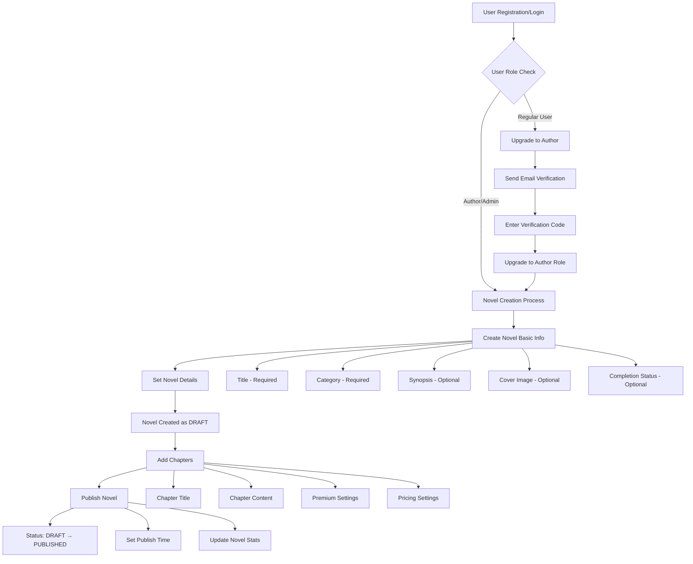
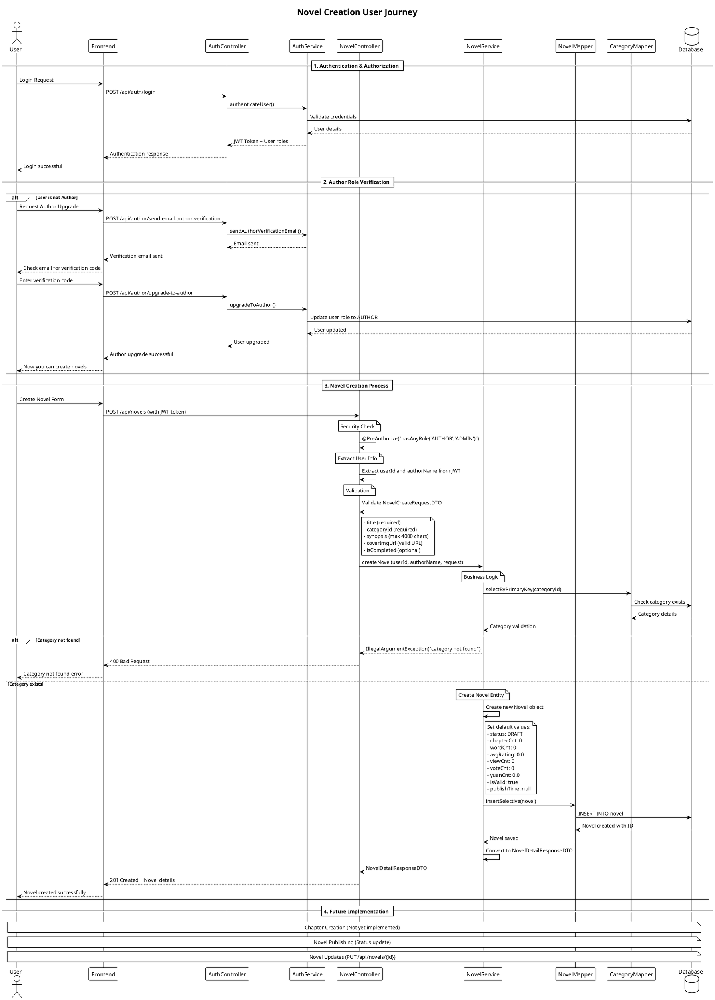
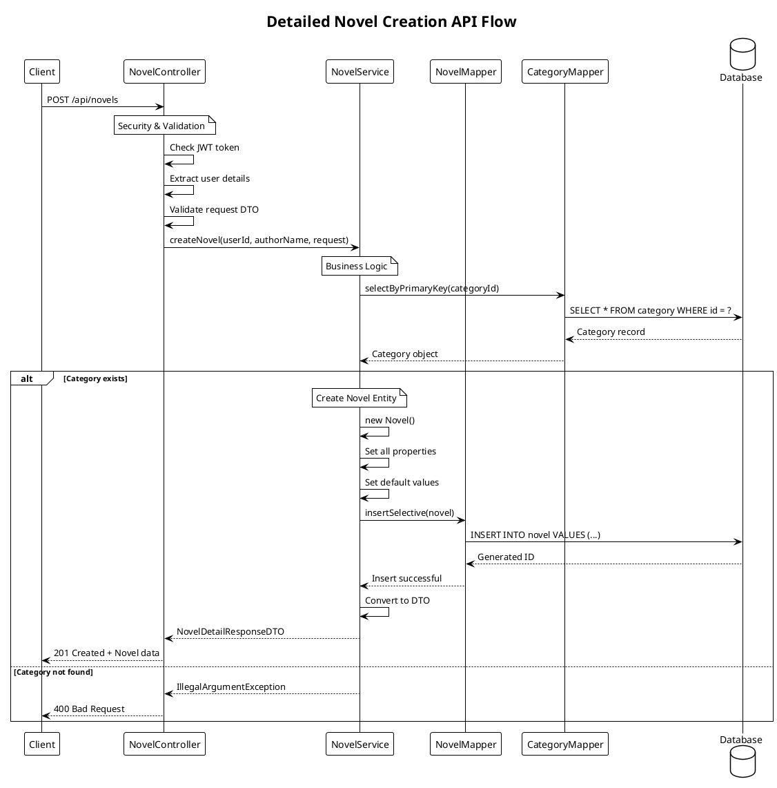
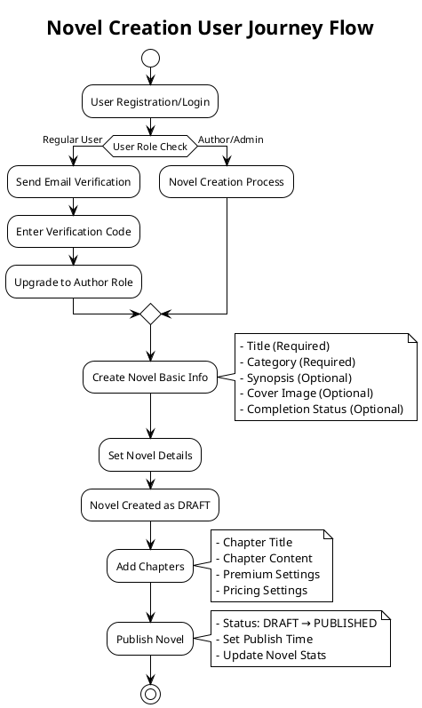
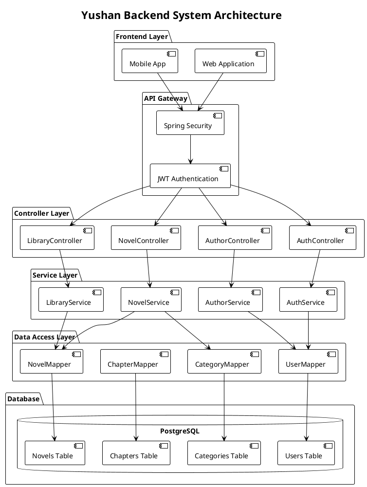
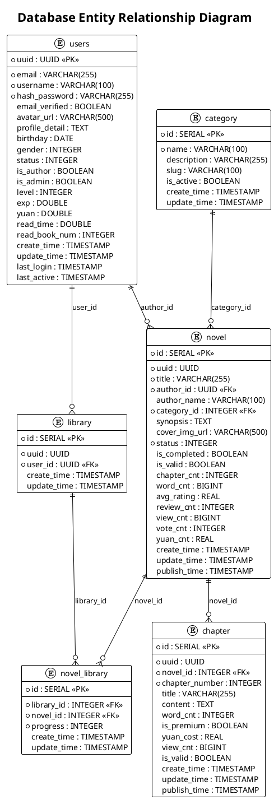

# Novel Creation User Journey Flow Analysis

## System Overview

Based on codebase analysis, the Yushan Backend system supports novel creation process with the following main components:

### 1. User Roles and Permissions
- **USER**: Regular user
- **AUTHOR**: Author who can create and manage novels
- **ADMIN**: Administrator with full privileges

### 2. Main Entities
- **User**: User information with `isAuthor`, `isAdmin` fields
- **Novel**: Novel with DRAFT/PUBLISHED/ARCHIVED status
- **Chapter**: Novel chapters
- **Category**: Novel classification categories

## User Journey Flow

## PlantUML Sequence Diagrams

### 1. Complete Novel Creation Process

### 2. Detailed API Flow Sequence

### 3. User Journey Flow Diagram

### 4. System Architecture Diagram

### 5. Database Entity Relationship

## API Endpoints Mapping

### Authentication & Authorization
- `POST /api/auth/register` - User registration
- `POST /api/auth/login` - User login
- `POST /api/author/upgrade-to-author` - Upgrade to author

### Novel Management
- `POST /api/novels` - Create novel (AUTHOR/ADMIN only)
- `GET /api/novels` - List novels (Public)
- `GET /api/novels/{id}` - Get novel details (Public)
- `PUT /api/novels/{id}` - Update novel (Owner/Author/Admin)

### Library Management
- `POST /library/{novelId}` - Add novel to library
- `DELETE /library/{novelId}` - Remove novel from library
- `GET /library` - Get personal library list