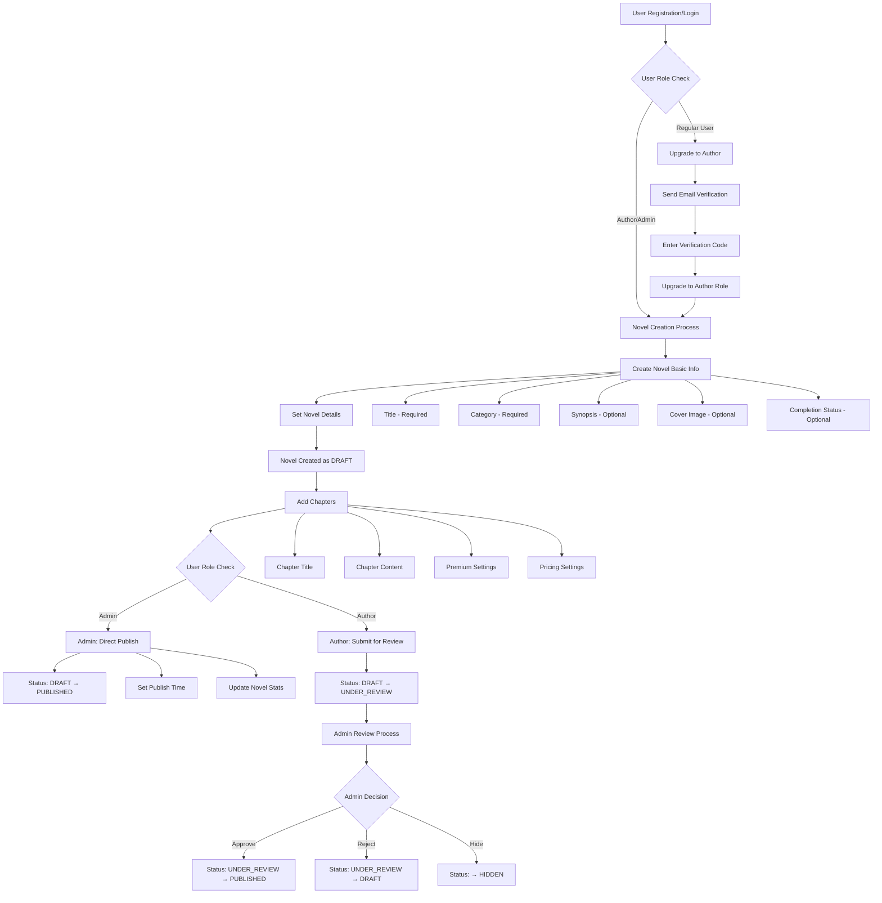
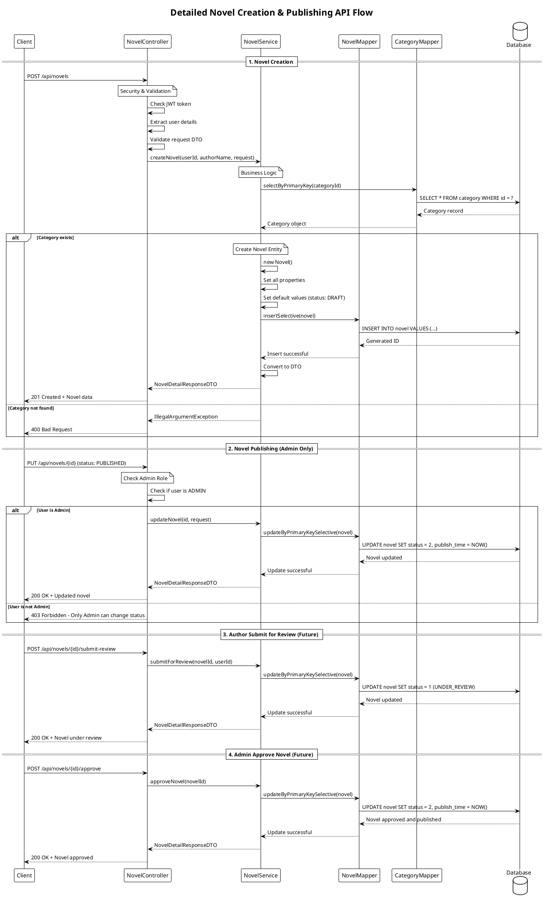
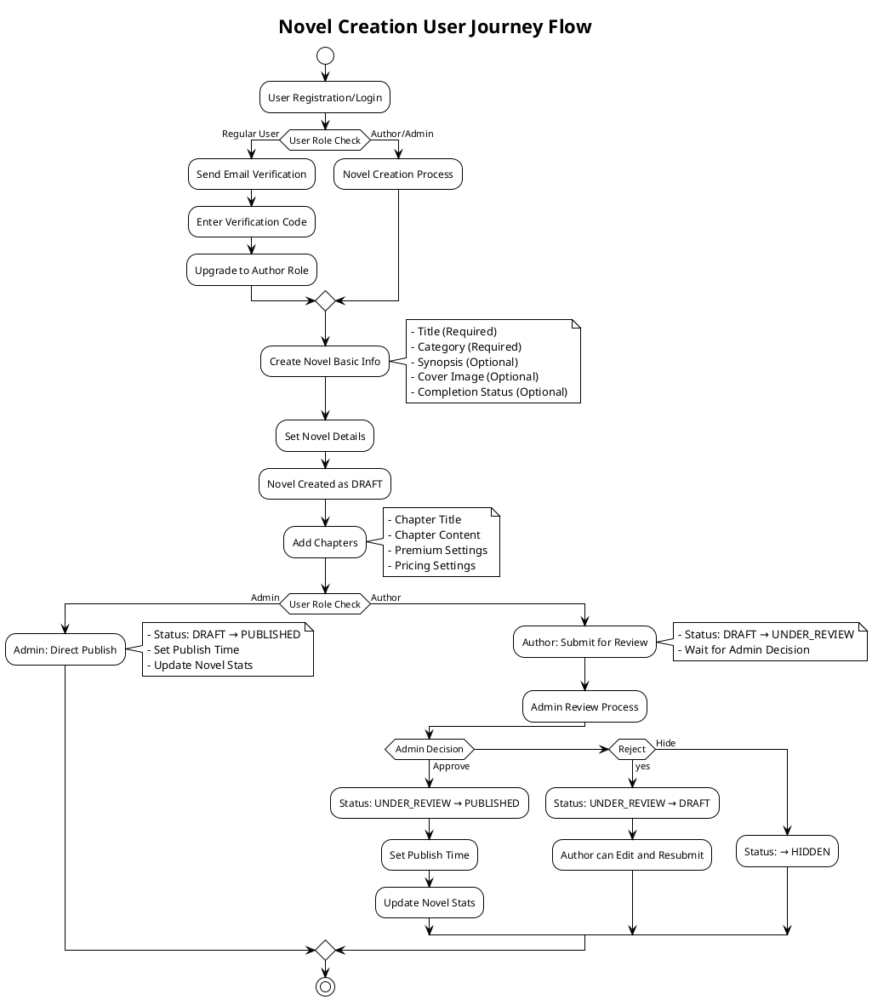
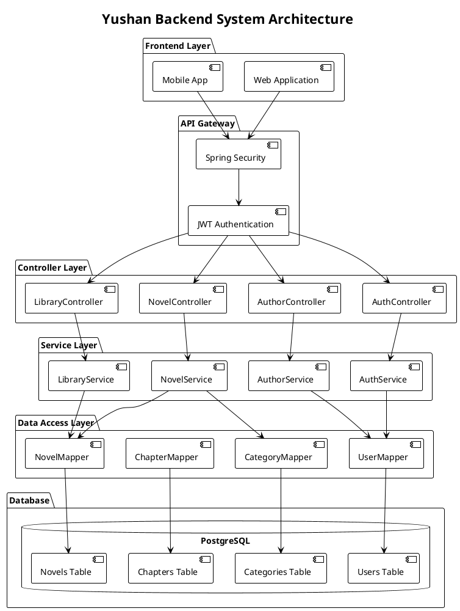
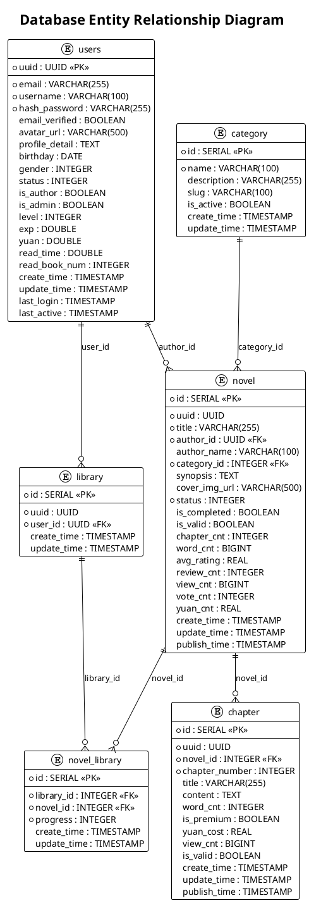

# Novel Creation User Journey Flow Analysis

## System Overview

Based on codebase analysis, the Yushan Backend system supports novel creation process with the following main components:

### 1. User Roles and Permissions
- **USER**: Regular user
- **AUTHOR**: Author who can create and manage novels
- **ADMIN**: Administrator with full privileges

### 2. Main Entities
- **User**: User information with `isAuthor`, `isAdmin` fields
- **Novel**: Novel with DRAFT/UNDER_REVIEW/PUBLISHED/HIDDEN status (ARCHIVED removed)
- **Chapter**: Novel chapters
- **Category**: Novel classification categories

## User Journey Flow



## PlantUML Sequence Diagrams

### 1. Complete Novel Creation Process

```plantuml
@startuml Novel Creation Process
!theme plain
title Novel Creation User Journey

actor User as U
participant Frontend as F
participant NovelController as NC
participant NovelService as NS
participant NovelMapper as NM
participant CategoryMapper as CM
database Database as DB

== 1. Novel Creation Process ==
U -> F: Create Novel Form
F -> NC: POST /api/novels (with JWT token)

note over NC: Security Check
NC -> NC: @PreAuthorize("hasAnyRole('AUTHOR','ADMIN')")

note over NC: Extract User Info
NC -> NC: Extract userId and authorName from JWT

note over NC: Validation
NC -> NC: Validate NovelCreateRequestDTO
note right of NC
- title (required)
- categoryId (required)
- synopsis (max 4000 chars)
- coverImgUrl (valid URL)
- isCompleted (optional)
end note

NC -> NS: createNovel(userId, authorName, request)

note over NS: Business Logic
NS -> CM: selectByPrimaryKey(categoryId)
CM -> DB: Check category exists
DB --> CM: Category details
CM --> NS: Category validation

alt Category not found
    NS --> NC: IllegalArgumentException("category not found")
    NC --> F: 400 Bad Request
    F --> U: Category not found error
else Category exists
    note over NS: Create Novel Entity
    NS -> NS: Create new Novel object
    note right of NS
    Set default values:
    - status: DRAFT
    - chapterCnt: 0
    - wordCnt: 0
    - avgRating: 0.0
    - viewCnt: 0
    - voteCnt: 0
    - yuanCnt: 0.0
    - isValid: true
    - publishTime: null
    end note
    
    NS -> NM: insertSelective(novel)
    NM -> DB: INSERT INTO novel
    DB --> NM: Novel created with ID
    NM --> NS: Novel saved
    
    NS -> NS: Convert to NovelDetailResponseDTO
    NS --> NC: NovelDetailResponseDTO
    NC --> F: 201 Created + Novel details
    F --> U: Novel created successfully
end

== 2. Novel Publishing Process ==
note over U,DB: Current Flow - Only Admin can change status directly
U -> F: Publish Novel
F -> NC: PUT /api/novels/{id} (with status: PUBLISHED)
NC -> NC: Check if user is ADMIN
alt User is Admin
    NC -> NS: updateNovel(id, request)
    NS -> NM: updateByPrimaryKeySelective(novel)
    NM -> DB: UPDATE novel SET status = 2, publish_time = NOW()
    DB --> NM: Novel updated
    NM --> NS: Update successful
    NS --> NC: NovelDetailResponseDTO
    NC --> F: 200 OK + Updated novel
    F --> U: Novel published successfully
else User is not Admin
    NC --> F: 403 Forbidden - Only Admin can change status
    F --> U: Access denied - Admin privileges required
end

== 3. Admin Approval Workflow (Future Enhancement) ==
note over U,DB: Enhanced Flow with Admin Approval

== 3.1. Author Submits for Review ==
U -> F: Submit for Review
F -> NC: POST /api/novels/{id}/submit-review
NC -> NS: submitForReview(novelId, userId)
NS -> NM: updateByPrimaryKeySelective(novel)
NM -> DB: UPDATE novel SET status = 1 (UNDER_REVIEW)
DB --> NM: Novel updated
NM --> NS: Update successful
NS --> NC: NovelDetailResponseDTO
NC --> F: 200 OK + Novel under review
F --> U: Novel submitted for review

== 3.2. Admin Reviews Novel ==
actor Admin as A
A -> F: View Novels Under Review
F -> NC: GET /api/novels/admin/under-review
NC -> NS: getNovelsUnderReview()
NS -> NM: selectByStatus(1) // UNDER_REVIEW
NM -> DB: SELECT * FROM novel WHERE status = 1
DB --> NM: Novels under review
NM --> NS: List of novels
NS --> NC: List<NovelDetailResponseDTO>
NC --> F: 200 OK + Novels list
F --> A: Display novels for review

== 3.3. Admin Approves Novel ==
A -> F: Approve Novel
F -> NC: POST /api/novels/{id}/approve
NC -> NS: approveNovel(novelId)
NS -> NM: updateByPrimaryKeySelective(novel)
NM -> DB: UPDATE novel SET status = 2, publish_time = NOW()
DB --> NM: Novel approved and published
NM --> NS: Update successful
NS --> NC: NovelDetailResponseDTO
NC --> F: 200 OK + Novel approved
F --> A: Novel approved and published

== 3.4. Admin Rejects Novel ==
A -> F: Reject Novel
F -> NC: POST /api/novels/{id}/reject
NC -> NS: rejectNovel(novelId)
NS -> NM: updateByPrimaryKeySelective(novel)
NM -> DB: UPDATE novel SET status = 0 (DRAFT)
DB --> NM: Novel rejected, back to draft
NM --> NS: Update successful
NS --> NC: NovelDetailResponseDTO
NC --> F: 200 OK + Novel rejected
F --> A: Novel rejected, author can edit and resubmit

== 4. Future Implementation ==
note over U,DB: Chapter Creation (Not yet implemented)
note over U,DB: Advanced Publishing Features
note over U,DB: Email Notifications for Approval Status

@enduml
```



### 2. Detailed API Flow Sequence



### 3. User Journey Flow Diagram



### 4. System Architecture Diagram



### 5. Database Entity Relationship



## Novel Status Flow

### Status Definitions
- **DRAFT**: Novel is being created/edited by author
- **UNDER_REVIEW**: Novel submitted by author, waiting for admin approval
- **PUBLISHED**: Novel approved and visible to public
- **HIDDEN**: Novel hidden by admin (not visible to public)

### Enhanced Workflow with Admin Approval

#### For Authors:
1. Create novel → Status: DRAFT
2. Add chapters and content
3. Submit for review → Status: DRAFT → UNDER_REVIEW
4. Wait for admin decision

#### For Admins:
1. Create novel → Status: DRAFT (can publish directly)
2. Review novels under review
3. Approve → Status: UNDER_REVIEW → PUBLISHED
4. Reject → Status: UNDER_REVIEW → DRAFT
5. Hide → Status: → HIDDEN

### Status Transitions
```
DRAFT → UNDER_REVIEW (Author submits)
UNDER_REVIEW → PUBLISHED (Admin approves)
UNDER_REVIEW → DRAFT (Admin rejects)
UNDER_REVIEW → HIDDEN (Admin hides)
PUBLISHED → HIDDEN (Admin hides)
HIDDEN → PUBLISHED (Admin unhides)
```

## API Endpoints Mapping

### Authentication & Authorization
- `POST /api/auth/register` - User registration
- `POST /api/auth/login` - User login
- `POST /api/author/upgrade-to-author` - Upgrade to author

### Novel Management
- `POST /api/novels` - Create novel (AUTHOR/ADMIN only)
- `GET /api/novels` - List novels (Public)
- `GET /api/novels/{id}` - Get novel details (Public)
- `PUT /api/novels/{id}` - Update novel (Owner/Author/Admin - Only Admin can change status)

### Novel Approval Workflow
- `POST /api/novels/{id}/submit-review` - Submit novel for review (AUTHOR only)
- `POST /api/novels/{id}/approve` - Approve novel for publishing (ADMIN only)
- `POST /api/novels/{id}/reject` - Reject novel (ADMIN only)
- `POST /api/novels/{id}/hide` - Hide novel (ADMIN only)
- `GET /api/novels/admin/under-review` - Get novels under review (ADMIN only)

### Category Management (for novel creation)
- `GET /api/categories/active` - Get active categories (Public)
- `GET /api/categories/{id}` - Get category by ID (Public)